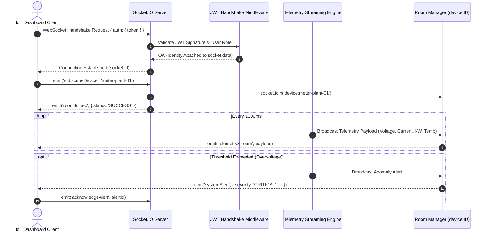

# Socket.IO Real-Time Telemetry & Event Streaming Platform

[](https://github.com/pkgtm2419/socketio-realtime-demo/actions)
[](LICENSE)
[](https://www.typescriptlang.org/)
[](https://socket.io/)

High-throughput, real-time telemetry streaming and notification platform engineered with **Socket.IO**, **Node.js**, and strict **TypeScript**. Implements JWT handshake authentication, dynamic room-based multi-tenant broadcasting, automated anomaly alarms, client delivery acknowledgments, and Redis Pub/Sub adapter support for horizontal multi-node scaling.

---

## ⚡ Real-Time WebSocket Architecture



---

## 🚀 Key Features

* **Strict TypeScript Event Contract:** Fully type-safe client-to-server and server-to-client event definitions preventing runtime payload drift.
* **Handshake Authentication:** Seamless token validation at initial connection via Socket.IO connection middleware.
* **Dynamic Room Partitioning:** Isolates telemetry metrics by device and facility (`device:meter-plant-01`) preventing cross-tenant leakage.
* **Telemetry Simulator:** Generates high-fidelity electrical telemetry (voltage, current, active power factor, frequency, thermal metrics).
* **Automated Anomaly Alarms:** Detects out-of-boundary operational conditions and pushes immediate critical alerts.
* **Horizontal Scaling Ready:** Compatible with `@socket.io/redis-adapter` for multi-instance cluster deployment.
* **Live Interactive Demo:** Built-in web client dashboard available at `http://localhost:4000`.

---

## 📁 Directory Structure

```text
socketio-realtime-demo/
├── .github/
│   └── workflows/
│       └── ci.yml               # Automated CI pipeline
├── public/
│   └── index.html               # Real-time interactive dashboard demo
├── src/
│   ├── config/                  # Environment & socket configuration
│   ├── middlewares/             # Handshake JWT authentication
│   ├── services/                # Telemetry simulator & stream generators
│   ├── types/                   # Strongly typed event definitions
│   ├── app.ts                   # Express web setup
│   └── server.ts                # Socket.IO bootstrap and event routing
├── tests/                       # Automated socket client tests
├── .env.example
├── package.json
├── tsconfig.json
└── README.md
```

---

## ⚡ Quick Start

### 1. Prerequisites
* Node.js v18.0.0 or higher
* npm v9.0.0 or higher

### 2. Installation
```bash
git clone https://github.com/pkgtm2419/socketio-realtime-demo.git
cd socketio-realtime-demo
npm install --force
```

### 3. Environment Setup
```bash
cp .env.example .env
```

### 4. Running the Server
```bash
# Start in development mode with live reload
npm run dev

# Compile TypeScript
npm run build

# Production start
npm start
```

Visit `http://localhost:4000` in your browser to view the live real-time telemetry dashboard.

---

## 📡 Event Dictionary

| Event Name | Direction | Payload | Description |
|:---|:---|:---|:---|
| `subscribeDevice` | Client ➔ Server | `deviceId: string` | Subscribes socket to device telemetry stream |
| `unsubscribeDevice` | Client ➔ Server | `deviceId: string` | Unsubscribes socket from device room |
| `telemetryStream` | Server ➔ Client | `TelemetryData` | Live voltage, current, power, frequency stream |
| `systemAlert` | Server ➔ Client | `SystemAlert` | Critical over-voltage / thermal alarm |
| `acknowledgeAlert` | Client ➔ Server | `alertId, callback` | Client acknowledgment of alarm delivery |

---

## 📜 License
MIT License. Free to use, adapt, and distribute for personal and commercial projects. Created by [Pawan Kumar Gautam](https://github.com/pkgtm2419).
