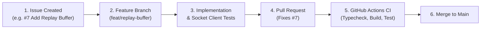

# Engineering & Real-Time Contribution Workflow

This document outlines the standard delivery lifecycle for WebSocket handlers, event schemas, and streaming services in `socketio-realtime-demo`.

---

## 1. WebSocket Feature Delivery Pipeline

---

## 2. Best Practices for Socket Development

1. **Handshake Security First:** Never expose unauthenticated WebSocket namespaces or broadcast channels. All client connections must authenticate during handshake.
2. **Room Isolation:** Always partition high-volume telemetry into discrete rooms (e.g., `device:iot-sensor-01`) rather than broadcasting globally.
3. **Automated Client Tests:** Every new event emission or subscription must include an automated Jest test using `socket.io-client`.
4. **Graceful Teardown:** Ensure socket listeners and telemetry intervals are cleanly cleared upon client disconnect to prevent memory leaks.
